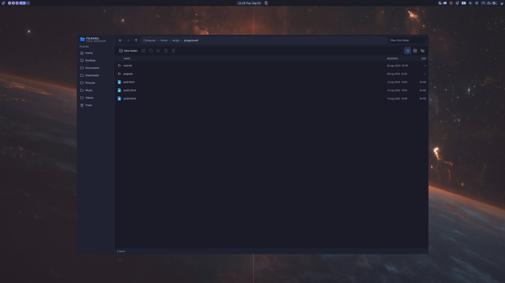

# FileSail

FileSail is a Quickshell-native file manager designed for tiled Wayland
desktops. The first host targets Noctalia 4 on Niri; the UI and backend are kept
portable for Omarchy/Hyprland.



The current MVP scaffold includes:

- details/list and icon-grid browsing;
- breadcrumbs, editable address (`Ctrl+L`), back/forward/up, and filtering;
- multi-selection, create folder, rename, copy, move, and Trash-by-default;
- XDG default-application opening;
- a reserved preview pane instead of tabs;
- persistent display preferences in `~/.config/filesail/config.json`;
- a normal tiled window and a native Noctalia plugin panel using the same UI.

## Dependencies

FileSail runs on Linux under a Wayland compositor. The standalone host requires
Quickshell (`qs` or `quickshell`), a working D-Bus session, and `xdg-utils` for
opening files and folders with the desktop defaults. Thumbnail previews require
a thumbnailer service such as Tumbler, but FileSail can run without one.

To build from source, install:

- CMake 3.24 or newer;
- a C++20 compiler;
- Qt 6.6 or newer with the Core, Concurrent, and DBus components, including the
  Qt Wayland platform plugin;
- `libarchive` and its development files;
- `pkg-config` (or an equivalent `pkgconf` implementation); and
- Quickshell.

The AppImage bundles FileSail, its backend, Qt, and the Quickshell runtime. It
still needs a Linux/Wayland desktop session and the host libraries required by
your compositor. `xdg-utils` is recommended for opening files from the
AppImage.

## Build the backend

```sh
cmake -S . -B build
cmake --build build
ctest --test-dir build --output-on-failure
```

## Install the standalone host

```sh
cmake --install build
```

This installs the `filesail` launcher, backend, desktop entry, QML tree, and
Noctalia adapter using CMake's configured install prefix. The checkout remains
usable for Noctalia plugin development through `scripts/install-noctalia.sh`.

The optional `org.freedesktop.FileManager1` integration is not included in the
standard package or AppImage. Arch users can opt in by building the separate
package in `integrations/dbus`; it depends on `filesail` and installs a user
service that can claim the session-bus name without replacing Nautilus files.
Enable it with:

```sh
systemctl --user enable --now filesail-filemanager1.service
```

Disable it with:

```sh
systemctl --user disable --now filesail-filemanager1.service
```

## Install from an Arch package

`PKGBUILD` builds the standalone package and declares its runtime dependencies:
`hicolor-icon-theme`, `libarchive`, `qt6-base`, `quickshell`, and `xdg-utils`.
Build and install it from the repository root with:

```sh
makepkg -si
```

The package build also uses CMake, Git, and `pkgconf`; `jq` is used by the
package checks. To add the Noctalia 4 panel and bar integration after installing
FileSail, build the optional package in `integrations/noctalia`:

```sh
cd integrations/noctalia
makepkg -si
```

The Noctalia package depends on both `filesail` and `noctalia-shell`.

## Install the AppImage

Download the AppImage from a GitHub release or workflow artifact, make it
executable, and launch it:

```sh
chmod +x FileSail-*-x86_64.AppImage
./FileSail-*-x86_64.AppImage
```

AppImages are self-contained and do not need to be installed system-wide. The
filename uses the version in `VERSION` and the machine architecture.

## Build an AppImage

The AppImage bundles FileSail, its backend, and the Quickshell runtime used by
the standalone host. Install the source-build dependencies above, plus `curl`
to download the linuxdeploy tools on the first run.

```sh
./scripts/build-appimage.sh
./dist/FileSail-$(tr -d '\n' < VERSION)-x86_64.AppImage
```

Use `FILESAIL_QS_PATH` when the Quickshell executable is not named `qs` or
`quickshell`. `FILESAIL_BUILD_DIR`, `FILESAIL_APPDIR`, and
`FILESAIL_OUTPUT_DIR` can be used to relocate intermediate and output files.

Tagged pushes (`v*`) and manual runs build the same AppImage in GitHub Actions
and upload it as an artifact. Tagged pushes also attach it to the GitHub
release.

## Run as a tiled window

```sh
./scripts/run.sh
./scripts/run.sh ~/Downloads
```

The launcher activates the existing standalone host when one is running, so
separate compositor-managed windows share one Quickshell engine and backend.
Use `--new-instance` temporarily when testing an isolated duplicate host.

## Install into Noctalia 4

```sh
./scripts/install-noctalia.sh
```

Enable FileSail under **Settings → Plugins**, then add the FileSail widget to the
bar. The panel can also be controlled through Noctalia IPC:

```sh
qs -c noctalia-shell ipc call plugin togglePanel filesail
```

The installer symlinks this checkout for plugin development and copies only the
backend executable to `~/.local/bin`. Ensure that directory is on the PATH of
the running Noctalia service.

## Next milestone

The scaffold deliberately leaves restore-from-Trash, an explicit **Open with…**
chooser, transfer progress/conflict UI, removable-volume controls, and preview
providers for the next iteration. There will be no tab system; additional
locations remain compositor-managed windows, while the reserved second pane is
for previews.

See [docs/architecture.md](docs/architecture.md) for module boundaries and MVP
trade-offs.

## Release version

The application version is defined once in [`VERSION`](VERSION). CMake, the
Noctalia manifest, AppImage packaging, Arch packaging, and release validation
derive their versions from that file.
