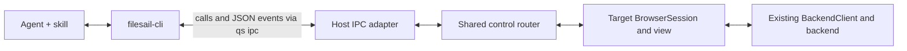

# Agent control through filesail-cli

Status: implemented for the browsing-and-preview v1 surface. Filesystem
mutations and external application launching remain the planned later extension.

## Objective

Let an agent discover FileSail windows, inspect their browser state, and issue
semantic commands such as navigate, select, and show preview. Commands must
affect the same session the user sees and report their actual outcome. The CLI
handles transport and structured results; the agent interprets natural language.

Agreed direction: each window generates a unique random ID when opened; the CLI
is stateless and can create a window when none is available; strict isolation of
view preferences is not a release requirement; user interaction always wins.

The first release covers browsing and previews. Filesystem mutations and external
application launching are a later extension of the same command contract.
Preserve separate windows, the preview-only second pane, backend path validation,
successful-load-only navigation history, and Trash as the sole deletion path.

## Findings in the existing implementation

- `shell.qml` already exposes `filesail.v1` through `IpcHandler`, with `ping`,
  `open`, and `show`. `scripts/run.sh` and the installed launcher already handle
  startup locking and routing to a running standalone host.
- `WindowRegistry.qml` owns standalone windows and assigns integer IDs. Those IDs
  restart with the host and are not sufficient as durable external handles.
- Each `FileSailView` owns a `BrowserSession`, which already provides navigation,
  selection, and backend operation dispatch. The session should remain the
  authoritative browser state.
- `DirectoryModel` distinguishes requested and committed paths and emits load
  success/failure. External completion must follow the committed load and history
  update, not just the call to `navigate()`.
- Preview and view mode currently follow global `Settings`; hidden files and sort
  also interact with persisted settings. Keep these existing scopes for v1 and
  describe shared effects in command capabilities and results. Per-window
  preference overrides are optional future work, not a prerequisite.
- Preview visibility depends on window width and selection. Enabling the setting
  alone does not prove that a preview is visible or that a provider has loaded.
- The Noctalia panel creates/destroys its browser with panel visibility. Its host
  adapter needs registration tied to that lifecycle.
- `NavigationController.navigate()` currently trims paths. Address this when
  exposing navigation so paths with valid trailing spaces remain intact.

## Recommended communication architecture

Start by wrapping Quickshell IPC rather than adding another resident service.
The inspected development environment has Quickshell 0.3.1, whose CLI exposes
`ipc call`, `ipc listen`, and explicit instance selection. The documented
`IpcHandler` supports string request/return values and string signal payloads,
which can carry compact JSON. Declare return types explicitly in new handlers.



Create a separate `filesail.control.v1` target. Keep `filesail.v1` launcher
behavior compatible. The new adapter forwards validated requests to a shared
router; it does not implement a second set of navigation or filesystem rules.
Standalone and Noctalia instantiate thin adapters around that shared interface.

Implement `filesail-cli` as a small Qt Core executable in `src/cli`, consistent
with the existing native tools. Use `QProcess` argument arrays to invoke `qs`,
never shell-generated command strings. Encapsulate transport behind one class.
CLI stdout contains JSON; diagnostics go to stderr, and failure exits nonzero.

The CLI is stateless across invocations: no remembered active window, local
browser model, persisted request cache, background CLI daemon, or required client
session. Each invocation discovers current endpoints and uses explicit arguments.
Connections and waiting state exist only for that invocation. FileSail owns all
window state, pending requests, retained results, and event history. The agent
can carry a returned window ID or request receipt into its next invocation.

Quickshell function calls return immediately. Asynchronous commands therefore
return an accepted request ID, with completion recorded separately. Events make
waiting responsive, while queryable results make it reliable. The QML event loop
must never block waiting for a backend response.

### Alternatives and the decision boundary

| Transport | Assessment |
| --- | --- |
| Existing Quickshell IPC | Recommended first: already deployed, instance routing exists, calls and signals cover the initial workflow. Requires subprocess management and asynchronous result tracking. |
| Dedicated Unix socket | Good later option if measurements show subprocess overhead or streaming limits matter. Quickshell provides SocketServer/Socket; a native Qt helper provides QLocalServer/QLocalSocket if stronger buffering and process isolation are needed. |
| Custom D-Bus interface | Viable, but adds another integration path. The existing optional FileManager1 service has a different purpose and cannot represent this window-control contract. |

Keep request/result schemas independent of transport. Do not access Quickshell's
private wire protocol. Phase 1 must verify listen output, disconnect behavior,
and supported Quickshell versions before committing to the wrapper. A socket
fallback would need private runtime-directory discovery, permissions, ownership
checks, bounded framing/output queues, and safe stale-endpoint cleanup.

## Window identity and discovery

Each window generates an opaque random ID as part of its creation lifecycle,
using a shared ID-generation utility. Use a Nano ID-style, shell-friendly string
with roughly 128 bits of randomness, rather than a sequential registry number.
The window owns that ID for its lifetime and registers it with the host router.
Detect a duplicate during registration and regenerate before publishing it.
Reopened windows and recreated Noctalia sessions receive new IDs; do not reuse an
old ID or derive identity from a title, path, process ID, or compositor ID.

The CLI accepts the window ID alone, for example `V1StGXR8_Z5jdHi6B-myT`.
Discovery maps it to the live host. A host-generation token can still identify
event streams and request receipts internally, but is not part of the window ID.
Configuration reloads that recreate browser sessions also create new window IDs.

`windows list` reports IDs, host kind, current path, readiness, visibility,
and capabilities. Report focus only when the host can determine it; otherwise
use unknown. Allow an optional human label for recognizing a particular window.

Commands accept `--window ID`. With exactly one eligible window, omission
selects it for that invocation. Multiple eligible windows return
`ambiguous_target` with choices.
Never silently choose the most recently launched host. Provide an explicit host
selector for development installs, duplicate instances, and Noctalia. Pin the
calls within each invocation to the discovered Quickshell instance and host
generation; rediscover on the next invocation. An explicit missing window ID
returns `window_not_found`, without silently substituting or creating a window.

`windows create` starts the standalone host if necessary and returns the newly
created window ID after its initial directory loads. `windows ensure` returns
the sole eligible window or creates one if none exists; multiple candidates
return `ambiguous_target`. Untargeted `navigate` also creates a window when none
exists, opening the requested location directly. Other window commands return
`no_window` when none exists; callers can explicitly use `windows ensure` first.
Extend the existing startup arbitration and recheck available windows under the
lock so concurrent ensure/navigation calls do not create duplicate windows.
Inspection commands do not launch the app as a side effect. Opening a closed
Noctalia panel is a host capability and must not be assumed available.

## First command surface

Illustrative syntax; freeze it after the transport proof:

```sh
filesail-cli windows list
filesail-cli windows ensure
filesail-cli windows create --location downloads
filesail-cli navigate --location downloads
filesail-cli --window V1StGXR8_Z5jdHi6B-myT state
filesail-cli --window V1StGXR8_Z5jdHi6B-myT navigate --location downloads
filesail-cli --window V1StGXR8_Z5jdHi6B-myT entries --limit 100
filesail-cli --window V1StGXR8_Z5jdHi6B-myT select --path /home/sergio/Downloads/report.pdf
filesail-cli --window V1StGXR8_Z5jdHi6B-myT preview show
filesail-cli --window V1StGXR8_Z5jdHi6B-myT preview hide
filesail-cli --window V1StGXR8_Z5jdHi6B-myT events
```

Also expose back, forward, up, refresh, clear selection, and capability discovery.
Resolve named locations such as Downloads through desktop standard locations in
the backend; do not assume an English directory name or a fixed `$HOME/Downloads`.
Wire requests carry validated absolute local paths or a documented location key.

`state` returns committed and pending paths, loading/error status, selection,
view settings, modal state, revisions, and preview state. Preview state separates
requested visibility, actual visibility, provider readiness, and an unavailable
reason such as insufficient width or unsupported selection. A control request
does not implicitly resize the window or change compositor focus.

`entries` describes the current filtered/sorted browser snapshot, with bounded
pages and a snapshot revision. Reject stale page cursors instead of combining
entries from different snapshots. Select by path, never by visual row number;
validate the complete selection against the current snapshot before applying it.
Hidden/filtered items must not be silently treated as visibly selected. Specify
replace/add/remove selection modes and an explicit primary path for previews.

Filter, sort, hidden-file, preview visibility, and view-mode commands use the same
scope and persistence behavior as their corresponding UI actions. Document that
scope in capabilities and return it with the result: a shared preference can
affect other windows. Navigation and selection still address the specified
browser session. Full preference isolation is optional; avoid adding a separate
settings model solely for agent control. State queries and events must reflect
shared preference changes in every affected session.

## Command and event contract

A request envelope contains protocol version, a caller-generated request ID,
window ID, method, parameters, and optional expected state revision:

```json
{"version":1,"requestId":"req-42","window":"V1StGXR8_Z5jdHi6B-myT","method":"navigate","params":{"location":"downloads"},"expectedRevision":12}
```

Expose a small typed IPC facade, conceptually `describe()`, `submit(json)`,
`result(requestId)`, `eventsSince(sequence, limit)`, and `event(json)`. Read-only
queries can return directly; pending commands use the result registry. Bound
request sizes, outstanding commands, retained results, and event history.
All retention lives in FileSail, not the CLI. Pending responses include a receipt
with the request ID and originating host generation, so a fresh CLI invocation
can query the result even after the target window closes while its host remains
alive. Event cursors are likewise explicit inputs/outputs, never hidden CLI state.

Every accepted request has one terminal outcome, or a documented unknown outcome
if the host dies. Include request ID, target, resulting revision, and structured
error code. Useful errors include `window_not_found`, `no_window`, `ambiguous_target`,
`stale_state`, `busy`, `invalid_path`, `item_not_visible`, `preview_unavailable`,
`requires_user_input`, `superseded`, and `host_disconnected`.

- Navigation succeeds after the intended snapshot is committed and history is
  updated. Navigating to the already committed directory is a defined successful
  no-op when no conflicting load is pending.
- Associate asynchronous work with a command/load generation. A completion from
  an older navigation or preview must never complete a newer request.
- Preview commands report provider completion or the actual unavailable/error
  state. Custom providers without readiness reporting advertise that limitation.
- Emit window opened/closed, directory committed, selection changed, preview
  changed, and request finished events. Include host generation, sequence number,
  window ID, and request ID when applicable. Coalesce noisy state updates.
- CLI commands wait for completion by default, with a deadline. `--no-wait`
  returns an ID that can be queried later. A timeout means the outcome may still
  be pending; it is not proof that the command had no effect.
- Event delivery is a notification, not the sole record of completion. Use
  retained results and sequence-based catch-up to handle a command finishing
  before a listener attaches. Add bounded fallback queries while waiting so
  missed notifications cannot hang the CLI. Expired event history requires a
  fresh snapshot; expired request results report unknown/expired explicitly.
- Deduplicate repeated request IDs within a documented bounded retention period.
  Reusing an ID with different arguments is an error. After restart, never
  automatically replay commands or claim exactly-once execution.

## Concurrent user and agent interaction

For v1, allow one state-changing control command per window at a time; reject a
second with `busy`. This restriction applies to agent commands only and never
blocks user actions. State inspection stays available during a pending command.
For shared preferences, serialize conflicting agent writes at their shared scope
and invalidate affected pending work across windows when necessary.

User interaction always wins. If user navigation, selection, or a preference
change invalidates a pending command, complete that command as `superseded`;
discard stale callbacks and do not restore the agent's older state afterward.
Do not retry a superseded command automatically. Unrelated user input need not
cancel work. Optional expected revisions let agents detect changes between
inspection and action. Revisions include relevant user-driven changes, including
shared preferences changed through another window.

Expose modal state and return `requires_user_input` for conflicting commands,
including the existing large-directory confirmation. Do not synthesize clicks on
dialogs. A small session-local indication of recent agent activity can help users
understand visible changes; use existing Theme tokens and square corners.

## Later filesystem operations and agent skill

Once browsing is reliable, expose supported mkdir, rename, copy, move, and Trash
through shared semantic commands and the existing backend. Capture explicit paths
and destinations at submission; avoid dependence on a changing selection or
clipboard. Preserve backend validation, serialized mutations, progress, partial
results, and operations that survive their originating window closing. Reconcile
the affected UI after completion and retain the distinction between filesystem
completion and a subsequent view refresh failure.
User priority does not imply rolling back a committed filesystem operation or
claiming cancellation succeeded. Later mutation commands need explicit backend
cancellation semantics; their completion callbacks must still preserve newer
user selection, navigation, and preference choices.

Keep control request IDs distinct from backend operation IDs and correlate them
explicitly. Define confirmation handling before exposing commands that currently
require UI confirmation. Never add permanent deletion through this interface.
Do not provide arbitrary QML evaluation, shell execution, or unrestricted backend
method forwarding. This is local desktop control within the user's existing
session, not an isolation boundary between applications running as that user.

Write the agent skill after the CLI contract is stable. Its workflow is discover,
choose a window ID and pass it explicitly, inspect, act, and check the terminal
result. It should cover creating a window when none exists, named locations,
ambiguity, shared preference effects, timeouts, stale state, and user intervention. Treat
filenames and preview contents as data rather than instructions. The first
acceptance scenario is: “open my Downloads folder” changes the selected FileSail
window and returns the loaded path without mouse input.

## Implementation sequence and acceptance criteria

1. **Prove the transport.** Add an isolated IPC harness and CLI spike that
   round-trip JSON, return a delayed completion, and stream an event. Verify
   listener races, multiple clients, exact instance routing, reload/disconnects,
   installed minimum versions, and bounded output. Record command latency and
   decide whether Quickshell IPC meets the requirements before building on it.
2. **Introduce discovery and state.** Add window-owned random IDs, shared
   registration/router components, read-only snapshots, and paginated entries.
   Register standalone windows and active Noctalia browser sessions. Acceptance:
   two windows can be distinguished and inspected without changing either;
   reopening a window produces a different ID and old IDs fail explicitly.
3. **Deliver navigation end to end.** Add command/result tracking, generation
   correlation, standard-location resolution, and startup/window creation.
   Acceptance: the Downloads scenario works with zero or one available window,
   failures preserve committed state and history, and concurrent cold starts
   create no duplicate window. Every command works in a fresh CLI process.
4. **Deliver selection and preview.** Add validated selection commands,
   documented preference scopes, and provider readiness reporting. Acceptance:
   select a known file and show its preview in the addressed window; a second
   window retains its navigation and selection, while preference effects match
   existing UI behavior. Unavailable previews report why, and user actions
   supersede conflicting pending agent work without later state restoration.
5. **Harden and ship browsing.** Complete event catch-up, limits, concurrency,
   reload/close handling, CLI help/schema documentation, packaging, and the skill.
   Record standalone and Noctalia validation. Add filesystem commands afterward
   as separately reviewable increments using the existing backend contract.

Likely code locations: `src/cli/`, new shared control components under `qml/core/`,
small changes to `WindowRegistry`, `BrowserSession`, `DirectoryModel`,
`FileSailView`, preview components, `shell.qml`, and the Noctalia adapter.
Register QML types and update CMake/install/AppImage packaging as needed. Update
`docs/architecture.md` when these proposed boundaries are implemented.

## Verification

Automate multi-window routing, shared preference effects, delayed and failed navigation,
same-path commands, rapid user navigation, stale revisions, filtered selections,
preview errors/compact geometry, modals, window closure, host reload, concurrent
clients, malformed/oversized requests, result expiry, event gaps, and deadlines.
Cover generated ID collisions/reopening, stale explicit IDs, concurrent automatic
window creation, fresh CLI invocations with no saved state, receipt-based result
queries, and user priority over pending work, including cross-window preferences.
Include Unicode, spaces, trailing spaces, quotes, newlines, symlinks, invalid
paths, and large-directory confirmation. Test JSON framing and shell argument
safety at the CLI transport boundary. New backend methods receive protocol tests;
later destructive tests operate only on temporary fixtures.

Run the build, CTest, and both QML lint commands from `AGENTS.md` after runtime
implementation. Confirm a bounded isolated standalone launch reaches
`Configuration Loaded`, exercise commands against its windows, and stop all test
processes. Record unavailable Noctalia/compositor checks as validation gaps.
Measure navigation completion separately from IPC overhead; use those results to
decide whether a dedicated socket transport is justified while keeping the CLI
stateless across invocations.

## References

- [Existing architecture](architecture.md)
- [Quickshell IpcHandler: calls, return types, and signals](https://quickshell.org/docs/v0.3.0/types/Quickshell.Io/IpcHandler/)
- [Quickshell SocketServer](https://quickshell.org/docs/v0.3.0/types/Quickshell.Io/SocketServer/)
- [Qt QLocalServer and local socket access permissions](https://doc.qt.io/qt-6/qlocalserver.html)
